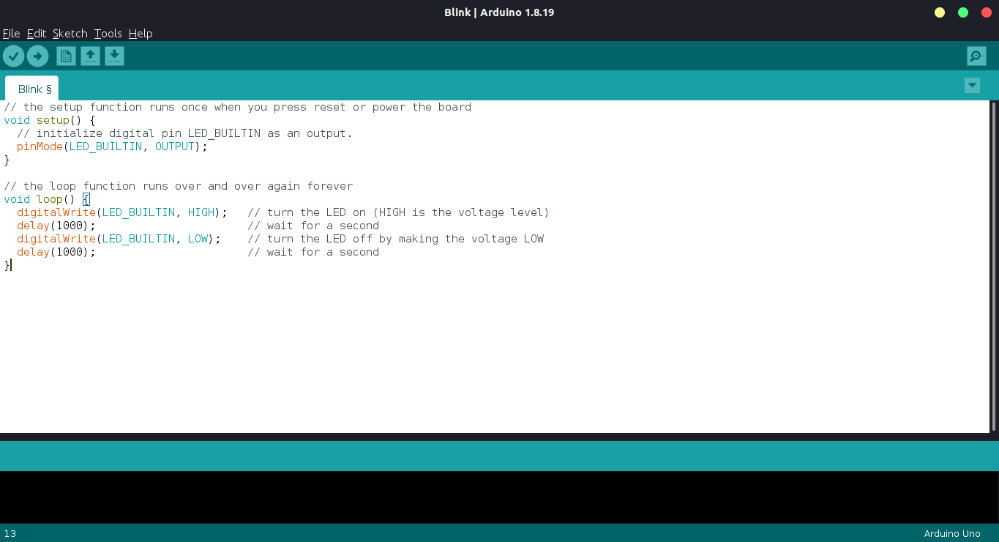
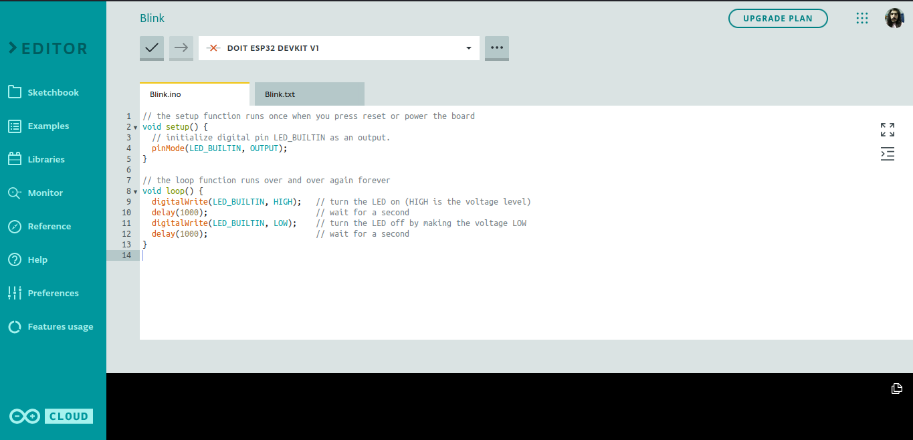
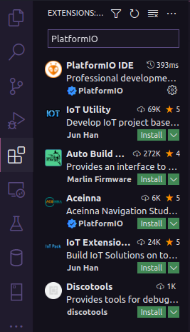
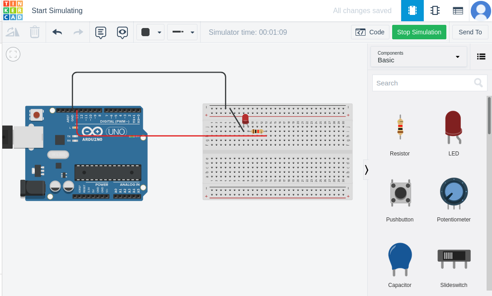
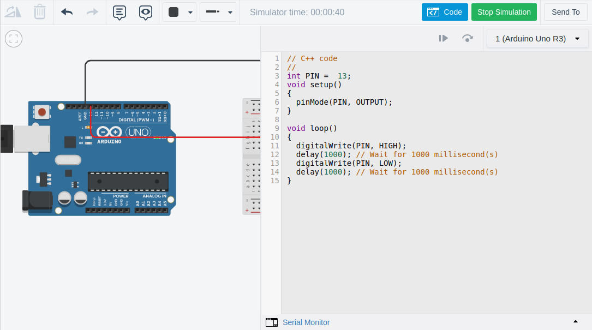

# Onde programar ?

## IDE Arduino:

É a mais utilizada para a programação com o arduino, tem uma interface bem simples e sugestiva, pode ser baixada no <a href="https://www.arduino.cc/en/software" target="_blank">site oficial</a>.

## Editor online:

É uma ótima opção para quem não quer ou não consegue rodar a IDE no computador, pode ser acessada pelo <a href="https://create.arduino.cc/editor" target="_blank">site oficial</a>.

## PlatformIO:

É uma boa opção para pessoas que usam o VScode, essa é a que eu utilizo para meus projetos. Pode ser baixada na parte de extenções.

## Tinkercad:

É uma boa opção para quem não tem o arduino, pois nele se pode além de escrever os códigos como nas outras IDEs se pode utlizar do arduino e de componentes eletronicos,fazendo assim seus testes e estudos.

 

[Anterior](../02/03-bibliotecas.md)

[Próximo](../04/04-Hardware.md)