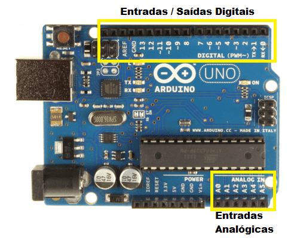

# Conhecimentos sobre hardware que podem resolver muitos problemas que podem surgir na montagem

## Explicações:

Vou tentar ser o mais simples possível sem usar termos muito técnicos para que possam entender e montarem seus projetos sem grandes surpresas.

## Funcionamento do arduino:

A placa do arduino possui uma porta com 6 entradas analógicas em que os valores lidos podem variar de 0 a 255, duas portas digitais uma contendo 8 entradas/saídas e uma contendo 6 entradas/saidas, 1 ground(terra) e 1 pino de referência análogica conforme visualizado na imagem a seguir:

## Entradas analógicas:

As entradas analógicas podem ser usadas dentro do bloco loop com o comando *analogRead(Pino)* e esta porta vai ler qualquer sinal que pode será convertido para valores expressos entre 0 e 255.

## Entradas/Saídas Digitais:

As entradas digitais podem ser usadas anteriormente configurando no bloco setup como o pino será útilizado usando o comando *pinMode(Pino/variável, INPUT)*  dentro do bloco loop com o comando *digitalRead(Pino)* e esta porta vai ler qualquer sinal que pode ser expresso pelos valores 0 que equivale ao sinal lógico LOW e 5V que equivale ao sinal lógico HIGH.
As saídas digitais.

As saídas digitais podem ser usadas anteriormente configurando no bloco setup como o pino será útilizado usando o comando *pinMode(Pino/variável, OUTPUT)*  dentro do bloco loop com o comando *digitalWrite(Pino, HIGH/LOW)* e esta porta vai escrever qualquer sinal que pode ser expresso pelos valores 0 que equivale ao sinal lógico LOW e 5V que equivale ao sinal lógico HIGH.

## Considerações das entrada digitais:

Os pinos quando configurados como leitura estão sujeitos a ruídos como se fosse uma antena de televisão que recebem sinais muito váriados e podem sofrer muita inteferência atrapalhando a leitura, para evitar esses ruídos podem ser evitados usando resistores que "absorvem" esses ruídos e serão configurados no setup pelo comando *pinMode(Pino,  INPUT_PULLUP)* e já pode usar o respectivo pino para leitura sem perceber os ruídos.

 

[Anterior](../03/01-ide.md )

[Próximo](../Exemplos-Praticos/Blink/blink.md)