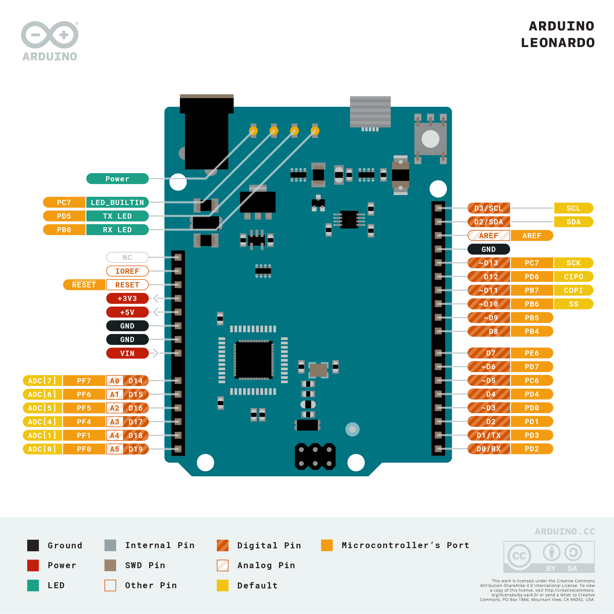

# O que é o Arduino Leonardo ?

É um microcontrolador assim como os outros arduinos, mas é baseado no *ATmega32u4*. Possui 20 pinos de entradas e saidas digitais, sendo 7 podem ser usadas como saídas **PWM** e 12 como entradas analógicas

## Diferenças com outras placas

O arduino Leonardo é identificado como se fosse um **mouse ou teclado**, além de uma porta serial/COM virtual  pois o ATmega32u4 possui comunicação USB integrada, eliminando a necessidade de um processador secundário.

## Pinagem

[Anterior](../Exemplos-Praticos/Led_LDR/led_ldr.md)

[Próximo](./02-funcoes.md)