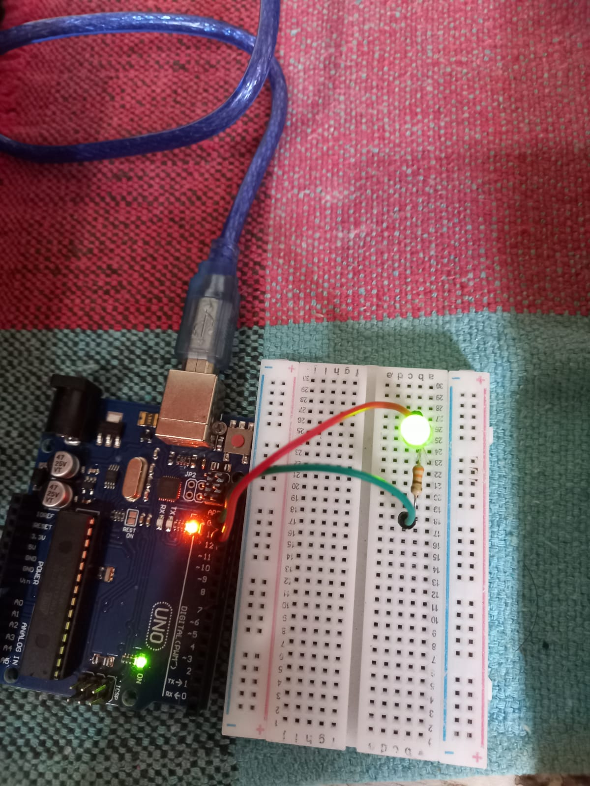
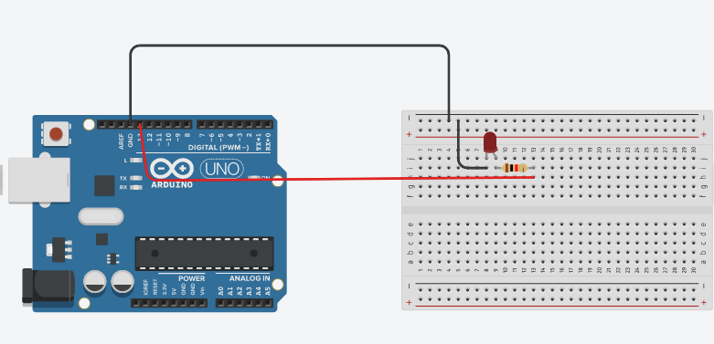

# Entendendo o Código

## Materiais necessários:

- Arduino
- Led
- Resistor 330 Ohms 5%
- Jumpers
## Passo a passo:

Acesse o [código](./Blink.ino) para ir acompanhando.

No começo do código temos a inicialização da *variavel* PIN do tipo *inteiro* recebendo o numero *13*.

```C++
int PIN = 13;
```
Logo em seguida temos a função *pinMode()* para configurar qual pino será utilzado. Recebendo como parâmetros o *PIN* que é qual o pino será usado e o *OUTPUT* que fiz que a porta mandará uma informação.

```C++
void setup() {
  pinMode(PIN, OUTPUT);
}
```
Agora temos o código que fará o led piscar. Nele temos a função *digitalWrite()*, que manda sinal para o pino ja setado anteriormente.<br>No primeiro momento a função liga o led com o parametro *HIGH*, que fica ligado por 1 segundo, pois a função *delay()*, faz com que haja uma espera para que seja executado o próximo comando, que no caso é outro *digitalWrite*, mas recebendo o parametro *LOW*, que intererrompe o sinal que está sendo mandando, ficando desligado por 1 segundo, por causa da função *delay()*.
```C++
void loop() {
  digitalWrite(PIN, HIGH);
  delay(1000);
  digitalWrite(PIN, LOW);
  delay(1000);
}

```

## Imagens do projeto montado

### Com o arduino:


### Utilizando o simulador Tinkercad:


[Anterior](../../03/01-ide.md)

[Próximo](../Potenciometro/potenciometro.md)