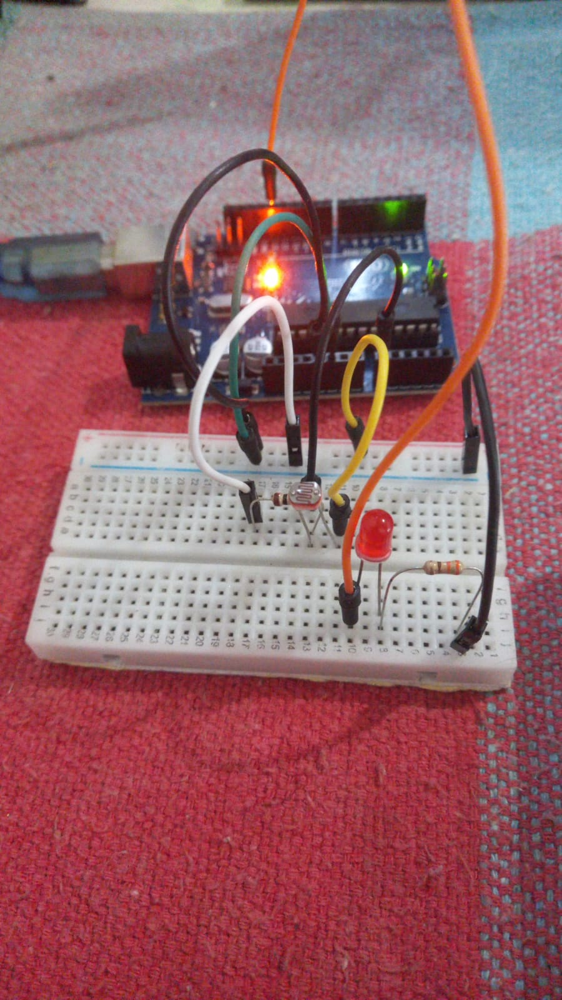
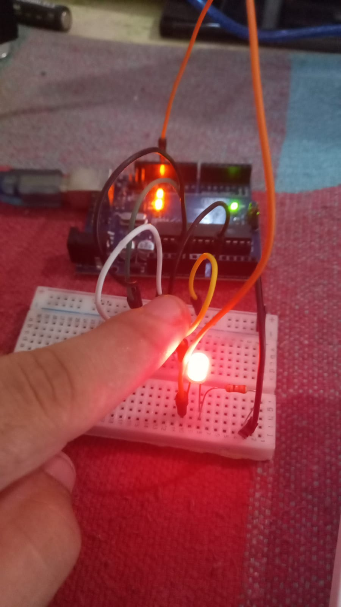
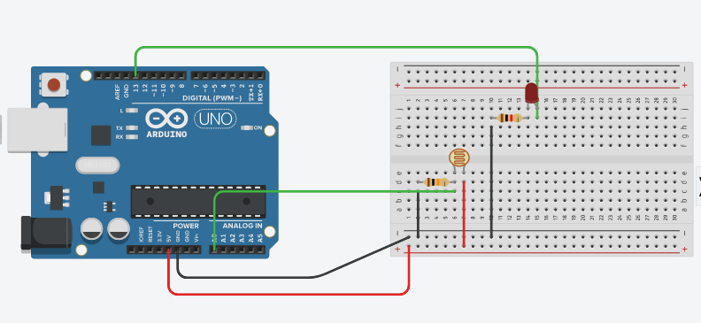

# Acendendo Led com o Sensor de Luminosidade (LDR)

## Materiais necessários:

- Arduino
- Sensor LDR
- Resistor 10K Ohms(Ω)
- Resistor 330 Ohms (Ω)
- Led
- Jumpers

## Passo a passo:
## Entendendo o Código

Acesse o [código](./led_ldr.ino) para ir acompanhando.

E inicializamos a *variável* "ldr" do tipo *inteiro*, que receberá o valor *A0* que representa a porta **analógica** do arduinio, a *variável* PIN_LED que receberá o valor 13 que representa a porta. E a "valorldr" que recebe o numero *0*.

```c++
int ldr = A0;
int valorldr = 0;
int PIN_LED = 13;
```

Logo em seguida na função *setup()* temos, a função pinMode(), que recebe a variável *ldr* e o parâmetro *INPUT* fazendo com que ele receba a informação do sensor. E um pinMode(), que recebe a variável *PIN_LED* e o parâmetro *OUTPUT* fazendo com que ele envie informação ao led.

```c++
void setup() {
  pinMode(ldr, INPUT);
  pinMode(PIN_LED, OUTPUT);
}
```

Em seguida na função *loop()* temos a variável *valorldr* que receberá o valor lido do sensor pela função *analogRead* que lê valores analogicos e recebe como parâmetro a variável *ldr* que é a porta em que está o sensor. Em seguida temos um *if* que recebe a condicional de *valorldr menor que 220* caso o valor seja menor o led acenderá, pois será efetuado o código *digitalWrite()* que recebe a variável *PIN_LED* com o parâmetro *HIGH* que mandará o sinal que acende o led. Caso o valor da leitura do sensor seja maior ele executa o código *digitalWrite* que ira apagar o led.

O valor usado na condicional pode mudar de acordo com a luminosidade do ambiente que você está fazendo esse projeto.

## Imagens do projeto montado

### Com o arduino:

<div>
   <br>
  
</div>

### Utilizando o simulador Tinkercad:



[Anterior](../Sensor_Luminosidade/read_ldr.md)

[Próximo](../../05/01-oque-e.md)