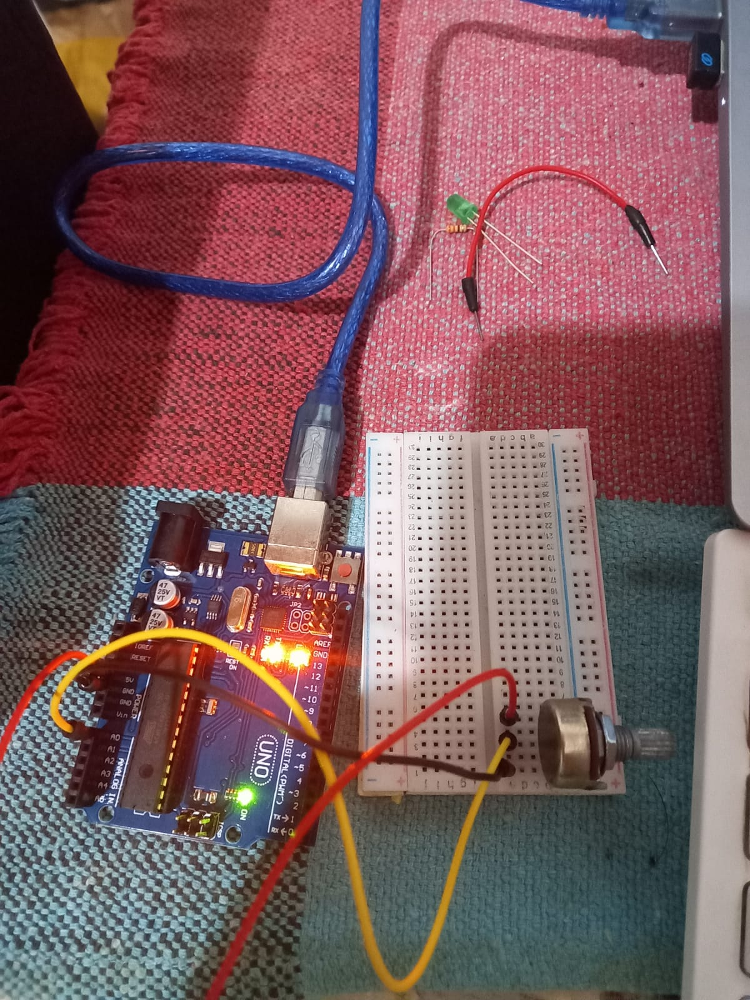

# Entendendo o Código

## Materiais necessários:

- Arduino
- Potenciômetro B10K
- Jumpers

## Passo a passo:

Acesse o [código](./potenciometro.ino) para ir acompanhando.

No começo do código temos a inicialização da *variavel* "potenciometro" do tipo *inteiro* recebendo o numero *A0*, que representa a **porta analógica 0**.

E inicalizamos a *variavel* "potenciometroValor" do tipo *inteiro*.

```C++
int potenciometro = A0;

int potenciometroValor;
```

Inicia a serial com Baud Rate de 9600

```C++
void setup() {
  Serial.begin(9600);
}
```
Agora temos o código que fará a leitura do potenciômetro. A variavel *potenciometroValor* recebe o valor do potenciômetro, que é lido pela função *analogRead* que faz a leitura das portas analógicas do arduino, recebendo como parâmetro a variavel *potenciometro*.<br>

Em seguida usamos a função *Serial.print* para imprimir no console o texto escrito. Depois usamos a mesma função para imprimir o valor armazenado na variavel *potenciometroValor*.

```C++
void loop() {
  potenciometroValor = analogRead(potenciometro);
  Serial.print("O valor do potenciometro = ");
  Serial.print(potenciometroValor);
  Serial.print("\n");
  delay(500);
}
```

## Imagens do projeto montado

### Com o arduino:

<div>
   <br>
  
</div>

### Utilizando o simulador Tinkercad:


### Serial Monitor com Valores do Potenciômetro:

