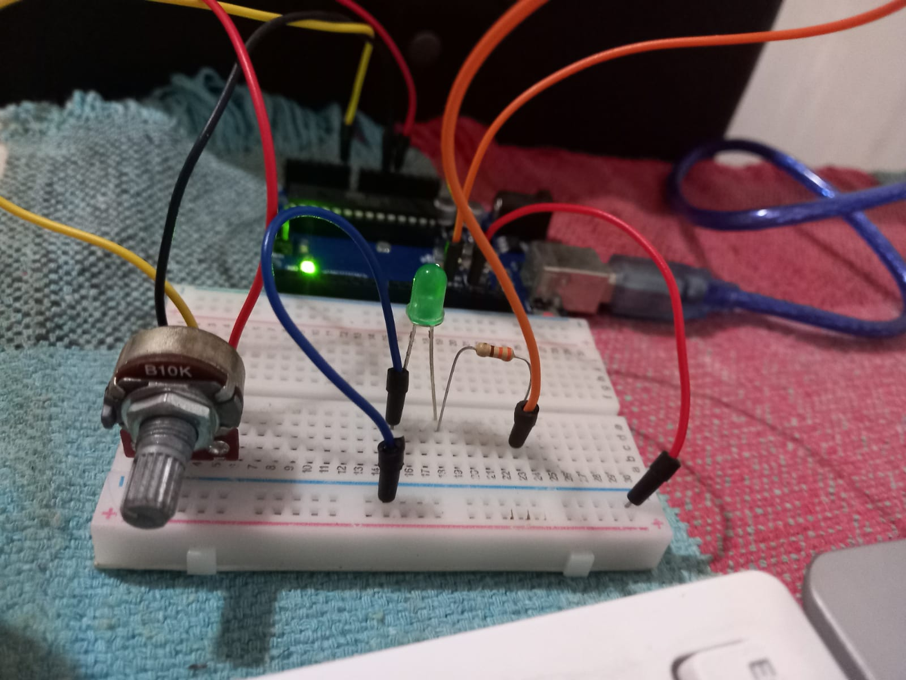
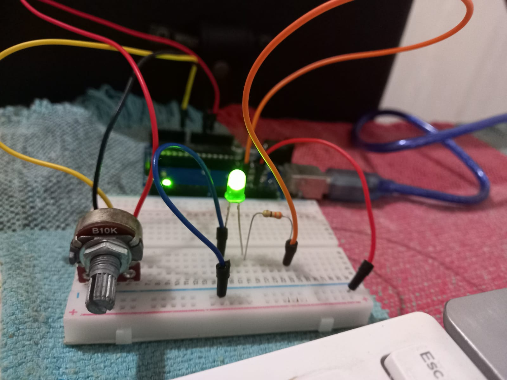
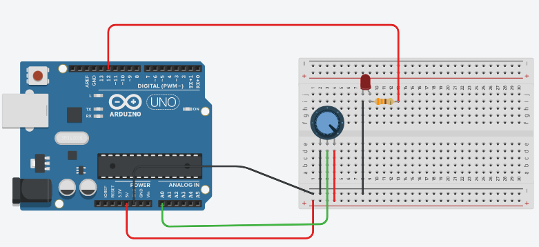

# Controlando led pelo potenciômetro

## Materiais necessários:

- Arduino
- Potenciômetro B10K
- Led
- Resistor 330 Ohms 5%
- Jumpers

## Entendendo o Código
## Passo a passo:

Acesse o [código](./pot_led.ino) para ir acompanhando.

O código dessa prática, é a junção dos dois códigos anteriores, havendo algumas modificações.

No começo do código temos a inicialização da *variavel* "potenciometro" do tipo *inteiro* recebendo o numero *A0*, que representa a **porta analógica 0**.

E inicalizamos a *variavel* "potenciometroValor" do tipo *inteiro*. E a "PIN_LED" que recebe o numero *12*.

```C++
int PIN_LED = 12;
int potenciometro = A0;

int potenciometroValor;
```
Logo em seguida temos a função *pinMode()* para configurar qual pino será utilzado. Recebendo como parâmetros o *PIN_LED* que é qual o pino será usado e o *OUTPUT* que fiz que a porta mandará uma informação.

```C++
void setup() {
pinMode(PIN_LED,OUTPUT);
}
```
Nessa parte final do código temos a variavel "potenciometroValor" recebendo os dados pela função *analogRead* que recebe como função a variavel "potenciometro" que contém o pino que será utilizado.<br> Logo em seguida convertemos o valor armazenado para variar de 0 a 255, com a função *map()*.<br> Com isso feito usamos a função *analogWrite()* que recebe os parâmetros *PIN_LED* para saber qual porta será utilizada e o parâmetro *potenciometroValor* que vai mandar a voltagem correspondente ao que será controlado pelo potenciômetro.
```C++
void loop() {
  potenciometroValor = analogRead(potenciometro);
  potenciometroValor = map(potenciometroValor,0,1023,0,255);
  analogWrite(PIN_LED,potenciometroValor);
}
```

## Imagens do projeto montado

### Com o arduino:

<div>
   <br>
  
</div>

### Utilizando o simulador Tinkercad:



[Anterior](../Potenciometro/potenciometro.md)