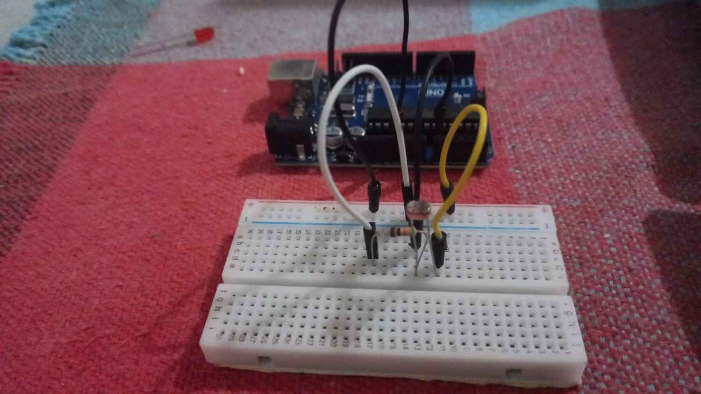

# Leitura do Sensor de Luminosidade

## Materiais necessários:

- Arduino
- Sensor LDR
- Resistor 10K Ohms(Ω)
- Jumpers
## Oque é o LDR?

O LDR(Light Dependent Resistor, Resistor Dependente de Luz), é um resistor que varia sua resistencia de acordo com a intensidade da luz.


## Passo a passo:
## Entendendo o Código

Acesse o [código](./read_ldr.ino) para ir acompanhando.

E inicializamos a *variável* "ldr" do tipo *inteiro*, que receberá o valor *A0* que representa a porta **analógica** do arduinio. E a "valorldr" que recebe o numero *0*.

```c++
int ldr = A0;
int valorldr = 0;
```

Logo em seguida na função *setup()* temos, a função pinMode(), que recebe a variável *ldr* e o parâmetro *INPUT* fazendo com que ele receba a informação do sensor. E temos o *Serial.begin* que é como será informada o resultado no terminal.

```c++
void setup() {
  pinMode(ldr, INPUT);
  Serial.begin(9600);
}
```

Em seguida na função *loop()* temos a variável *valorldr* que receberá o valor lido do sensor pela função *analogRead* que lê valores analogicos e recebe como parâmetro a variável *ldr* que é a porta em que está o sensor. Depois temos um *Serial.print* que mostrará no **console** a mensagem e o valor recebido.

```c++
void loop() {
   valorldr=analogRead(ldr);
   Serial.print("Valor LDR = "); 
   Serial.println(valorldr);
}
```

## Imagens do projeto montado

### Com o arduino:

<div>
   <br>
  
</div>

### Utilizando o simulador Tinkercad:


### Resultado no console:


[Anterior](../Potenciometro_Led/controla_led.md)