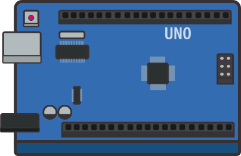

  

# Arduino4noobs 

  

Neste 4noobs focarei mais a parte da programação do arduino, você pode aprender mais sobre C++ na <a href="https://github.com/Novout/cpp4noobs" target="_blank">Cpp4Noobs</a>.

## Conteúdos

- [O que é arduino](./01/01-arduino.md)
- [O que são variáveis](./02/01-variaveis.md)
- [O que são funções](./02/02-funcoes.md)
- [O que são bibliotecas](./02/03-bibliotecas.md)
- [Onde programar](./03/01-ide.md)
- [Exemplos Práticos](./Exemplos-Praticos/)
  * [Blink - Piscar Led](./Exemplos-Praticos/Blink/blink.md)
  * [Potenciômetro - Leitura Monitor Serial](./Exemplos-Praticos/Potenciometro/potenciometro.md)
  * [Potenciômetro Controlando Led](./Exemplos-Praticos/Potenciometro_Led/controla_led.md)
  * [Leitura do Sensor de Luminosidade(LDR)](./Exemplos-Praticos/Sensor_Luminosidade/read_ldr.md)
  * [Acendendo led com Sensor de Luminosidade(LDR)](./Exemplos-Praticos/Led_LDR/led_ldr.md)

## Quero contribuir

Para contribuir com esse projeto maravilhoso, você:

1. Precisará criar um fork deste repositório
2. Criar um branch com o padrão: `feature/awesome-commit`
3. Criar seu conteúdo maravilhoso nesta branch
4. Criar um pull-request neste repositório lindo
5. Esperar a avaliação do mesmo

## Autor

- **Henrique Machado Broseghini** - Desenvolvedor Front-end -  [Twitter](https://twitter.com/BrosHenrique) - [Dev.to](https://dev.to/henriquebros)
---
 
  

  

